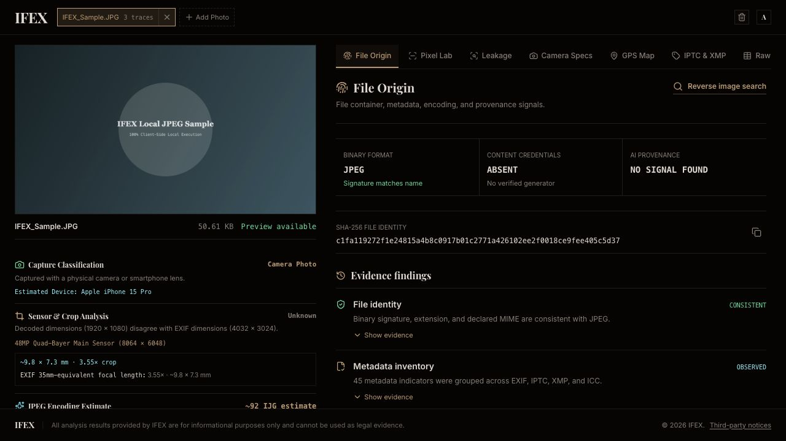
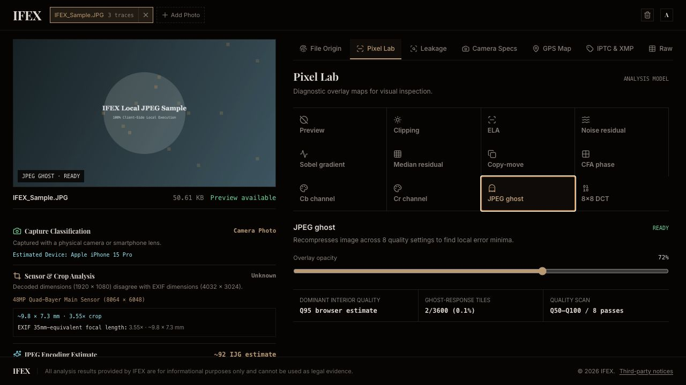
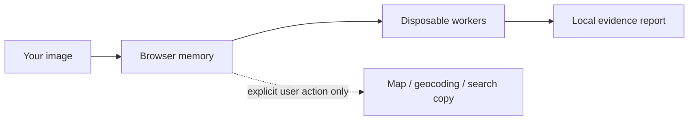

<div align="center">

# IFEX

### Local-first image forensics, without the upload.

Inspect metadata leakage, file provenance, camera traces, JPEG structure, C2PA credentials, and pixel-level anomalies directly in your browser or desktop app.

<p>
  <a href="https://github.com/eunjjang3/IFEX/actions/workflows/ci.yml"></a>
  <a href="https://github.com/eunjjang3/IFEX/releases/latest"></a>
  <a href="LICENSE"></a>
  
  <a href="https://github.com/eunjjang3/IFEX/stargazers"></a>
</p>

<p>
  <a href="#quick-start"><strong>Quick start</strong></a> ·
  <a href="#what-you-can-inspect"><strong>Features</strong></a> ·
  <a href="#privacy-model"><strong>Privacy</strong></a> ·
  <a href="#desktop-app"><strong>Desktop</strong></a> ·
  <a href="#deployment"><strong>Deployment</strong></a>
</p>



<sub>Real IFEX output generated from the bundled, non-identifying local sample.</sub>

</div>

> [!IMPORTANT]
> IFEX reports observed evidence and bounded heuristics. It does not certify authenticity, assign a privacy score, prove that a file is safe, or replace expert examination.

## Why IFEX?

Most online metadata tools begin with an upload. IFEX begins with a boundary: the analyzed file stays in browser memory, parsing runs in disposable Web Workers, and the normal preview path uses a size-limited PNG re-encoded locally.

- **Local-first by design** — analyzed files and metadata are not uploaded to an IFEX server.
- **Evidence before verdicts** — findings explain what was observed and where the method stops.
- **Deep JPEG inspection** — structure, quantization, subsampling, quality estimates, and diagnostic overlays.
- **Provenance-aware** — C2PA Content Credentials and IPTC Digital Source Type semantics are inspected conservatively.
- **Browser and desktop** — use the same sandboxed workspace on the web, macOS, or Windows.
- **English · 한국어 · 日本語** — instant, persisted language switching with locally bundled typography.

If IFEX is useful to your investigations, research, or photography workflow, consider giving the repository a star. It helps other curious people find it.

## What you can inspect

| Surface | What IFEX shows |
| --- | --- |
| **File Origin** | Binary signature, extension/MIME consistency, SHA-256 identity, JPEG structure, processing traces, and C2PA signals |
| **Leakage** | Metadata fields that may expose identity, device details, timestamps, software, thumbnails, or location |
| **Camera Specs** | Camera and lens identity, serials, focal length, firmware, sensor evidence, crop factor, and JPEG quality estimate |
| **GPS Map** | Embedded coordinates, opt-in OpenStreetMap tiles, opt-in reverse geocoding, and external map links |
| **IPTC & XMP** | Structured editorial, rights, provenance, and application metadata |
| **Raw Tags** | Searchable source-level metadata values and namespaces |
| **Pixel Lab** | Clipping, ELA, residuals, gradients, copy-move candidates, CFA phase, chroma planes, JPEG Ghost, and 8×8 DCT energy |

### Pixel Lab



Pixel Lab renders diagnostic maps directly over the local preview:

- clipping and channel saturation;
- JPEG error-level analysis (ELA);
- high-frequency noise and median-filter residuals;
- Sobel edge gradients;
- copy-move block matches with neighborhood displacement agreement;
- Bayer CFA phase-residual approximation;
- separated Cb and Cr chroma channels;
- multi-pass JPEG Ghost scanning from Q50 to Q100;
- decoded-luminance 8×8 DCT energy.

These are investigative leads, not proof of manipulation. The CFA view is a lightweight phase heuristic rather than the full Popescu–Farid EM detector, and the DCT view works from decoded pixels rather than original bitstream coefficients.

## Quick start

### Browser development

Requires **Node.js 22.12 or newer**.

```bash
git clone https://github.com/eunjjang3/IFEX.git
cd IFEX
npm ci
npm run dev
```

Open the local URL printed by Vite, then choose an image or click **Use a local sample** for a safe product tour.

### Docker

```bash
git clone https://github.com/eunjjang3/IFEX.git
cd IFEX
docker compose up --build
```

Open <http://localhost>. Override the host port with `IFEX_PORT` in a local `.env` file when needed.

### Verify everything

```bash
npm run verify
```

The verification suite checks licenses, unit tests, lint, desktop entry points, TypeScript, the production build, and the build-environment allowlist. Container behavior and hardened headers can be checked separately with:

```bash
./scripts/verify-container.sh
```

The script binds a uniquely named test container to a Docker-assigned `127.0.0.1` port and removes its container and image when finished.

## Supported files

IFEX recognizes **JPEG, PNG, WebP, AVIF, HEIC/HEIF, TIFF, DNG, Nikon NEF, and Canon CR2** by bounded signature inspection. Strict mode is enabled by default and rejects extension or MIME mismatches, unknown signatures, empty files, and generic `.raw` files without an identifiable supported format.

A RAW file may produce metadata and structure results without a preview when the browser cannot safely decode an embedded image.

### Browser requirements

Safe analysis requires Web Workers, `OffscreenCanvas.convertToBlob`, and `createImageBitmap`. IFEX fails closed when those APIs are unavailable unless an operator explicitly enables `IFEX_ALLOW_UNSAFE_PREVIEW`.

Support is feature-based rather than user-agent-based. Test the production build in every browser required by a deployment, especially for HEIC/HEIF and RAW previews because decoder availability varies by browser and operating system.

## Privacy model



Opening IFEX and analyzing an image do not upload the image or its metadata to an IFEX server. UI fonts, camera data, IPTC vocabulary, WASM, and analysis code are bundled with the application.

External network access occurs only after a matching user action:

- **Load external map** requests OpenStreetMap tiles. The provider receives the browser IP, site origin through the standard Referer, and tile coordinates approximating the embedded location—not the image file.
- **Fetch Address** sends the exact embedded coordinates and site origin to Nominatim. Requests are globally serialized with at least one second between starts.
- **Map links** send coordinates to Google Maps, Apple Maps, or OpenStreetMap when opened.
- **Reverse image search** creates and downloads a metadata-free JPEG locally. Pixels leave the browser only if the user later uploads that copy to a selected service.

The selected provider's privacy policy applies once the user chooses to contact it.

## Desktop app

IFEX also runs as a sandboxed Electron application on macOS and Windows. The renderer has no Node.js integration or direct filesystem privileges; its preload bridge exposes only the desktop platform identifier. Permissions and webviews are denied, and only explicitly allowlisted HTTPS origins may open in the system browser.

Start Vite and Electron together:

```bash
npm run desktop:dev
```

Build an unpacked application bundle for the current host:

```bash
npm run desktop:package
```

Explicit targets are available for macOS arm64, macOS x64, and Windows x64:

```bash
npm run desktop:package:mac:arm64
npm run desktop:package:mac:x64
npm run desktop:package:win:x64
```

Bundles are written to `release/`. Development bundles are unsigned, are not notarized, and are not wrapped in a DMG/MSI installer. Production distribution should build on the target operating system and add platform signing before publishing.

## Deployment

The production Docker image builds the Vite application and serves static output through Nginx. Docker and Coolify deployments read `IFEX_*` values when the container starts, so limits can change without rebuilding the image.

Copy [`.env.example`](.env.example) to `.env` for Docker/Compose overrides. Static Vite deployments can use the documented `VITE_IFEX_*` equivalents at build time; runtime values take precedence. Invalid or out-of-range values fall back to hardened defaults.

<details>
<summary><strong>Runtime configuration reference</strong></summary>

| Runtime variable | Default | Allowed range |
| --- | ---: | ---: |
| `IFEX_STRICT_FILE_TYPES` | `true` | `true` / `false` |
| `IFEX_MAX_FILE_MIB` | `25` | 1–512 |
| `IFEX_MAX_ACTIVE_FILES` | `4` | 1–50 |
| `IFEX_MAX_ACTIVE_MIB` | `64` | 1–2048 |
| `IFEX_MAX_IMAGE_MEGAPIXELS` | `40` | 1–200 |
| `IFEX_MAX_PREVIEW_DIMENSION` | `2048` | 256–8192 |
| `IFEX_STATISTICS_SAMPLE_DIMENSION` | `400` | 64–1024 |
| `IFEX_MAX_EMBEDDED_THUMBNAIL_DIMENSION` | `1024` | 128–4096 |
| `IFEX_MAX_PIXEL_DIMENSION` | `2048` | 256–4096 |
| `IFEX_MAX_SEARCH_COPY_DIMENSION` | `1600` | 256–4096 |
| `IFEX_SEARCH_COPY_JPEG_QUALITY_PERCENT` | `90` | 50–100 |
| `IFEX_PARSE_CONCURRENCY` | `1` | 1–4 |
| `IFEX_PARSE_TIMEOUT_MS` | `15000` | 1000–120000 |
| `IFEX_PIXEL_TIMEOUT_MS` | `20000` | 1000–120000 |
| `IFEX_MAX_METADATA_TAGS` | `2000` | 100–10000 |
| `IFEX_MAX_METADATA_VALUE_CHARS` | `16384` | 256–1048576 |
| `IFEX_MAX_METADATA_TOTAL_CHARS` | `1048576` | 65536–16777216 |
| `IFEX_ALLOW_UNSAFE_PREVIEW` | `false` | `true` / `false` |

See [`.env.local.example`](.env.local.example) for local Vite development. Docker build contexts exclude `.env` and `.env.*` files.

</details>

### Automated releases

Pushing a version tag matching `package.json` starts the release workflow. For example, package version `0.2.0` requires tag `v0.2.0`.

```bash
npm version patch
git push origin main --follow-tags
```

After the verification and container gates pass, the workflow:

- packages unsigned macOS arm64, macOS x64, and Windows x64 ZIPs;
- publishes a multi-platform `linux/amd64` and `linux/arm64` image to `ghcr.io/eunjjang3/ifex`;
- creates a GitHub Release with SHA-256 checksums and build provenance attestations.

Stable container tags include the exact version, major/minor version, major version, and `latest`.

```bash
docker pull ghcr.io/eunjjang3/ifex:latest
```

GitHub Container Registry packages may be private when first created. Set the package visibility to public once for anonymous pulls, or authenticate the deployment host with `read:packages` access. Desktop archives remain labeled `unsigned`; SmartScreen and Gatekeeper may warn until platform signing and Apple notarization are configured.

## Analysis and security notes

<details>
<summary><strong>Hardened analysis boundaries</strong></summary>

- File intake reads at most 4,100 bytes for signature detection. `file-type` provides an independent second opinion restricted to the existing allowlist.
- Encoded JPEG, PNG, and WebP dimensions are checked before decoding when their standard headers are available, then checked again after decode.
- Originals are analyzed in disposable workers. Normal previews are size-limited PNGs re-encoded in the browser.
- JPEG structure output is capped at 4,096 segments and 16 quantization tables.
- C2PA collections, metadata counts, metadata text, concurrency, active bytes, and execution time are bounded before crossing worker boundaries.
- Hashes, metadata, C2PA, file structure, and Pixel Lab calculations still use the original local file; the displayed preview is not byte-for-byte identical.

These controls reduce exposure to parser exploits and resource-exhaustion images. They are not an antivirus verdict and do not prove that a file is harmless.

</details>

<details>
<summary><strong>Analysis references and local datasets</strong></summary>

- Runtime EXIF parsing uses `exifr`; representative tests are independently checked with development-only `ExifReader`.
- JPEG traversal, quantization extraction, end-of-image handling, and subsampling detection share one bounded parser.
- C2PA Digital Source Type values are interpreted against a pinned local transform of the official IPTC vocabulary. Only IPTC-defined generative-AI concepts produce an AI provenance signal.
- Camera sensor and crop-factor interpretation uses a locally bundled Lensfun-derived dataset with explicit attribution.

Dataset refreshes are explicit development actions and require network access:

```bash
npm run update:lensfun
npm run update:iptc-source-types
```

Normal image analysis uses only the committed local datasets.

</details>

## Project links

- Found a vulnerability? Read the [Security Policy](SECURITY.md) and report it privately.
- Want to help? Start with [Contributing](CONTRIBUTING.md) and the [Code of Conduct](CODE_OF_CONDUCT.md).
- Looking for changes? See the [Changelog](CHANGELOG.md) and [latest release](https://github.com/eunjjang3/IFEX/releases/latest).
- Reviewing dependencies or assets? See [Third-Party Notices](THIRD_PARTY_NOTICES.md).

## License

IFEX source code is available under the [MIT License](LICENSE). Third-party dependencies, fonts, datasets, and assets remain subject to their respective licenses.

The camera crop-factor dataset is adapted from Lensfun under CC BY-SA 3.0. The bundled IPTC Digital Source Type vocabulary is an attributed transform under CC BY 4.0. Complete production dependency license text and development-only notices are recorded in [Third-Party Notices](THIRD_PARTY_NOTICES.md).

<div align="center">

**Inspect locally. Interpret carefully. Share evidence responsibly.**

</div>
